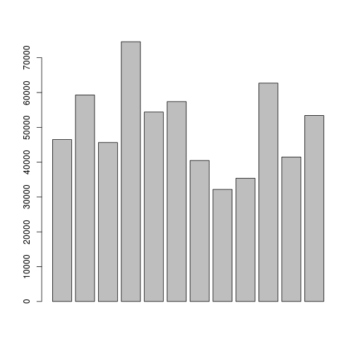
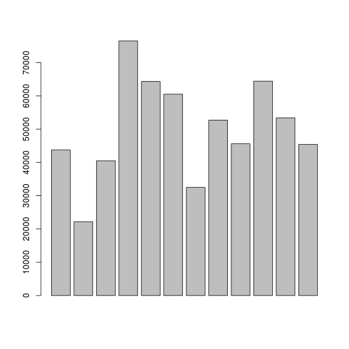
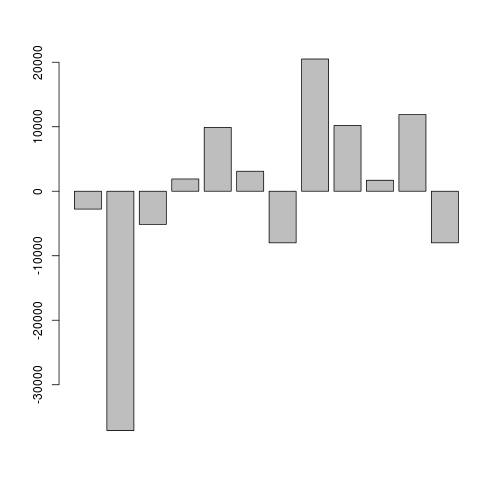
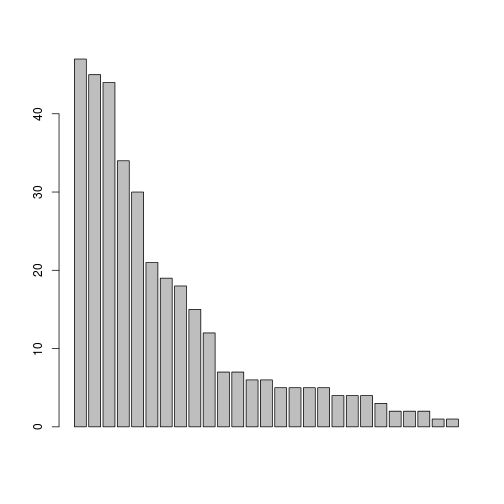
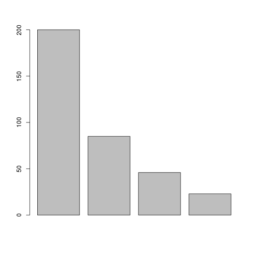

Old Testament

```r
ot <- c(61, 50, 33, 44, 43, 28, 29, 5, 39, 34, 37, 35, 34, 39, 13, 19, 9, 41, 
    101, 29, 10, 8, 73, 72, 8, 59, 19, 11, 6, 9, 3, 4, 7, 3, 4, 4, 2, 12, 3)
length(ot)
```

```
## [1] 39
```

```r
sum(ot)
```

```
## [1] 1040
```

```r
sort(ot)
```

```
##  [1]   2   3   3   3   4   4   4   5   6   7   8   8   9   9  10  11  12
## [18]  13  19  19  28  29  29  33  34  34  35  37  39  39  41  43  44  50
## [35]  59  61  72  73 101
```

```r
rev(sort(ot))
```

```
##  [1] 101  73  72  61  59  50  44  43  41  39  39  37  35  34  34  33  29
## [18]  29  28  19  19  13  12  11  10   9   9   8   8   7   6   5   4   4
## [35]   4   3   3   3   2
```

```r
plot(ot)
```

 

```r
plot(rev(sort(ot)))
```

 

```r
ot/sum(ot)
```

```
##  [1] 0.058654 0.048077 0.031731 0.042308 0.041346 0.026923 0.027885
##  [8] 0.004808 0.037500 0.032692 0.035577 0.033654 0.032692 0.037500
## [15] 0.012500 0.018269 0.008654 0.039423 0.097115 0.027885 0.009615
## [22] 0.007692 0.070192 0.069231 0.007692 0.056731 0.018269 0.010577
## [29] 0.005769 0.008654 0.002885 0.003846 0.006731 0.002885 0.003846
## [36] 0.003846 0.001923 0.011538 0.002885
```

The Book of Numbers

```r
Numbers0112 <- c(54, 34, 51, 49, 31, 27, 89, 26, 23, 36, 35, 16)
Numbers1324 <- c(33, 45, 41, 50, 13, 32, 22, 29, 35, 41, 30, 25)
Numbers2536 <- c(17, 65, 23, 31, 40, 16, 54, 42, 56, 29, 34, 13)

Numbers <- c(Numbers0112, Numbers1324, Numbers2536)

sum(Numbers)
```

```
## [1] 1287
```

```r
mean(Numbers)
```

```
## [1] 35.75
```

```r
var(Numbers)
```

```
## [1] 249.8
```

```r
sd(Numbers)
```

```
## [1] 15.8
```

```r
summary(Numbers)
```

```
##    Min. 1st Qu.  Median    Mean 3rd Qu.    Max. 
##    13.0    25.8    33.5    35.8    42.8    89.0
```

```r
plot(Numbers)
```

 

```r
plot(sort(Numbers))
```

 

New Testament

```r
nt <- c(45, 30, 47, 34, 44, 19, 18, 12, 7, 7, 6, 5, 4, 3, 5, 4, 2, 2, 15, 5, 
    5, 4, 6, 1, 1, 2, 20)
sum(nt)
```

```
## [1] 353
```

```r
length(nt)
```

```
## [1] 27
```

```r
sort(nt)
```

```
##  [1]  1  1  2  2  2  3  4  4  4  5  5  5  5  6  6  7  7 12 15 18 19 20 30
## [24] 34 44 45 47
```

```r
rev(sort(nt))
```

```
##  [1] 47 45 44 34 30 20 19 18 15 12  7  7  6  6  5  5  5  5  4  4  4  3  2
## [24]  2  2  1  1
```

```r
plot(sort(nt))
```

 

```r
mean(nt)
```

```
## [1] 13.07
```

```r
rev(sort(nt/sum(nt)))
```

```
##  [1] 0.133144 0.127479 0.124646 0.096317 0.084986 0.056657 0.053824
##  [8] 0.050992 0.042493 0.033994 0.019830 0.019830 0.016997 0.016997
## [15] 0.014164 0.014164 0.014164 0.014164 0.011331 0.011331 0.011331
## [22] 0.008499 0.005666 0.005666 0.005666 0.002833 0.002833
```

```r
hist(rev(sort(nt/sum(nt))))
```

 

Bible

```r
bible <- c(ot, nt)
length(bible)
```

```
## [1] 66
```

```r
sum(bible)
```

```
## [1] 1393
```

```r
mean(bible)
```

```
## [1] 21.11
```

```r
plot(bible)
```

 

```r
plot(sort(bible))
```

 

```r
mean(ot)
```

```
## [1] 26.67
```

```r
mean(nt)
```

```
## [1] 13.07
```

```r
mean(bible)
```

```
## [1] 21.11
```

Census #1

```r
reu <- 46500
sim <- 59300
gad <- 45650
jud <- 74600
iss <- 54400
zeb <- 57400
eph <- 40500
man <- 32200
ben <- 35400
dan <- 62700
ash <- 41500
nap <- 53400
tribes <- c(reu, sim, gad, jud, iss, zeb, eph, man, ben, dan, ash, nap)
sum(tribes)
```

```
## [1] 603550
```

```r
tribes/sum(tribes)
```

```
##  [1] 0.07704 0.09825 0.07564 0.12360 0.09013 0.09510 0.06710 0.05335
##  [9] 0.05865 0.10389 0.06876 0.08848
```

```r
plot(tribes)
```

 

```r
plot(sort(tribes))
```

 

```r
sort(tribes/sum(tribes))
```

```
##  [1] 0.05335 0.05865 0.06710 0.06876 0.07564 0.07704 0.08848 0.09013
##  [9] 0.09510 0.09825 0.10389 0.12360
```

```r

Judah <- c(jud, iss, zeb)
J <- sum(Judah)

Reuben <- c(reu, sim, gad)
R <- sum(Reuben)

Ephraim <- c(eph, man, ben)
E <- sum(Ephraim)

Dan <- c(dan, ash, nap)
D <- sum(Dan)

divs <- c(J, R, E, D)
sum(divs)
```

```
## [1] 603550
```

```r
divs/sum(divs)
```

```
## [1] 0.3088 0.2509 0.1791 0.2611
```

```r

barplot(divs)
```

 

```r
barplot(tribes)
```

 

Census #2

```r
reu2 <- 43730
sim2 <- 22200
gad2 <- 40500
jud2 <- 76500
iss2 <- 64300
zeb2 <- 60500
eph2 <- 32500
man2 <- 52700
ben2 <- 45600
dan2 <- 64400
ash2 <- 53400
nap2 <- 45400
tribes2 <- c(reu2, sim2, gad2, jud2, iss2, zeb2, eph2, man2, ben2, dan2, ash2, 
    nap2)
sum(tribes2)
```

```
## [1] 601730
```

```r
tribes2/sum(tribes2)
```

```
##  [1] 0.07267 0.03689 0.06731 0.12713 0.10686 0.10054 0.05401 0.08758
##  [9] 0.07578 0.10702 0.08874 0.07545
```

```r
plot(tribes2)
```

 

```r
plot(sort(tribes2))
```

 

```r
sort(tribes2/sum(tribes2))
```

```
##  [1] 0.03689 0.05401 0.06731 0.07267 0.07545 0.07578 0.08758 0.08874
##  [9] 0.10054 0.10686 0.10702 0.12713
```

```r

Judah2 <- c(jud2, iss2, zeb2)
J2 <- sum(Judah2)

Reuben2 <- c(reu2, sim2, gad2)
R2 <- sum(Reuben2)

Ephraim2 <- c(eph2, man2, ben2)
E2 <- sum(Ephraim2)

Dan2 <- c(dan2, ash2, nap2)
D2 <- sum(Dan2)

divs2 <- c(J2, R2, E2, D2)
sum(divs2)
```

```
## [1] 601730
```

```r
divs2/sum(divs2)
```

```
## [1] 0.3345 0.1769 0.2174 0.2712
```

```r

barplot(divs2)
```

 

```r
barplot(tribes2)
```

 

```r

sum(divs)/sum(divs2)
```

```
## [1] 1.003
```

```r
divs - divs2
```

```
## [1] -14900  45020 -22700  -5600
```

```r
tribes2 - tribes
```

```
##  [1]  -2770 -37100  -5150   1900   9900   3100  -8000  20500  10200   1700
## [11]  11900  -8000
```

```r
plot(tribes2 - tribes)
```

 

```r
barplot(tribes2 - tribes)
```

 

New Testament Divisions
-----------------------


```r
par(mfrow = c(1, 1))

Lk <- 47
Mt <- 45
Ac <- 44
Jn <- 34
Mk <- 30

Rv <- 21
Ro <- 19
C1 <- 18
He <- 15
C2 <- 12

Ga <- 7
Ep <- 7
J1 <- 6
Ph <- 6
Co <- 5
T1 <- 5
Jm <- 5
P1 <- 5

H1 <- 4
T2 <- 4
P2 <- 4
H2 <- 3
Tt <- 2
Pm <- 2
Ju <- 2
J2 <- 1
J3 <- 1

Hvy <- c(Lk, Mt, Ac, Jn, Mk)
Mid <- c(Rv, Ro, C1, He, C2)
Lit <- c(Ga, Ep, J1, Ph, Co, T1, Jm, P1)
Fly <- c(H1, T2, P2, H2, Tt, Pm, Ju, J2, J3)
All <- c(Hvy, Mid, Lit, Fly)

barplot(All)
```

 

```r
sum(All)
```

```
## [1] 354
```

```r
All/sum(All)
```

```
##  [1] 0.132768 0.127119 0.124294 0.096045 0.084746 0.059322 0.053672
##  [8] 0.050847 0.042373 0.033898 0.019774 0.019774 0.016949 0.016949
## [15] 0.014124 0.014124 0.014124 0.014124 0.011299 0.011299 0.011299
## [22] 0.008475 0.005650 0.005650 0.005650 0.002825 0.002825
```

```r

sum(Hvy)/sum(All)
```

```
## [1] 0.565
```

```r
sum(Mid)/sum(All)
```

```
## [1] 0.2401
```

```r
sum(Lit)/sum(All)
```

```
## [1] 0.1299
```

```r
sum(Fly)/sum(All)
```

```
## [1] 0.06497
```

```r

sH <- sum(Hvy)
sM <- sum(Mid)
sL <- sum(Lit)
sF <- sum(Fly)

sA <- c(sH, sM, sL, sF)
barplot(sA)
```

 

```r
sA
```

```
## [1] 200  85  46  23
```


