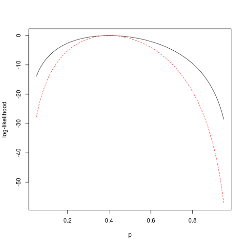

# Regression

These notes explain how to perform basic 
regression analysis in R.

## Simple Linear Regression

```r
# Simple Linear Regression
fit <- lm(weight ~ height, data = women)
summary(fit)
```

```
## 
## Call:
## lm(formula = weight ~ height, data = women)
## 
## Residuals:
##    Min     1Q Median     3Q    Max 
## -1.733 -1.133 -0.383  0.742  3.117 
## 
## Coefficients:
##             Estimate Std. Error t value Pr(>|t|)    
## (Intercept) -87.5167     5.9369   -14.7  1.7e-09 ***
## height        3.4500     0.0911    37.9  1.1e-14 ***
## ---
## Signif. codes:  0 '***' 0.001 '**' 0.01 '*' 0.05 '.' 0.1 ' ' 1 
## 
## Residual standard error: 1.53 on 13 degrees of freedom
## Multiple R-squared: 0.991,	Adjusted R-squared: 0.99 
## F-statistic: 1.43e+03 on 1 and 13 DF,  p-value: 1.09e-14
```

```r

women$weight
```

```
##  [1] 115 117 120 123 126 129 132 135 139 142 146 150 154 159 164
```

```r

fitted(fit)
```

```
##     1     2     3     4     5     6     7     8     9    10    11    12 
## 112.6 116.0 119.5 122.9 126.4 129.8 133.3 136.7 140.2 143.6 147.1 150.5 
##    13    14    15 
## 154.0 157.4 160.9
```

```r

residuals(fit)
```

```
##        1        2        3        4        5        6        7        8 
##  2.41667  0.96667  0.51667  0.06667 -0.38333 -0.83333 -1.28333 -1.73333 
##        9       10       11       12       13       14       15 
## -1.18333 -1.63333 -1.08333 -0.53333  0.01667  1.56667  3.11667
```

```r

plot(women$height, women$weight, xlab = "Height (in inches)", ylab = "Weight (in pounds)")
abline(fit)
```

 


## Polynomial Regression

```r
# Polynomial Regression
fit2 <- lm(weight ~ height + I(height^2), data = women)
summary(fit2)
```

```
## 
## Call:
## lm(formula = weight ~ height + I(height^2), data = women)
## 
## Residuals:
##     Min      1Q  Median      3Q     Max 
## -0.5094 -0.2961 -0.0094  0.2862  0.5971 
## 
## Coefficients:
##              Estimate Std. Error t value Pr(>|t|)    
## (Intercept) 261.87818   25.19677   10.39  2.4e-07 ***
## height       -7.34832    0.77769   -9.45  6.6e-07 ***
## I(height^2)   0.08306    0.00598   13.89  9.3e-09 ***
## ---
## Signif. codes:  0 '***' 0.001 '**' 0.01 '*' 0.05 '.' 0.1 ' ' 1 
## 
## Residual standard error: 0.384 on 12 degrees of freedom
## Multiple R-squared: 0.999,	Adjusted R-squared: 0.999 
## F-statistic: 1.14e+04 on 2 and 12 DF,  p-value: <2e-16
```

```r

plot(women$height, women$weight, xlab = "Height (in inches)", ylab = "Weight (in pounds)")
lines(women$height, fitted(fit2))
```

 


