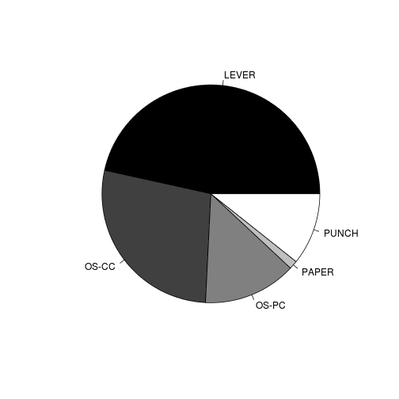
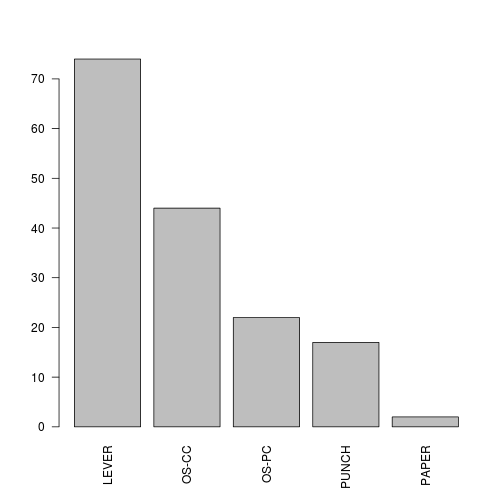

# Regression

These notes explain how to perform basic 
regression analysis in R.

## Simple Linear Regression

```r
# Simple Linear Regression
fit <- lm(weight ~ height, data = women)
summary(fit)
```

```
## 
## Call:
## lm(formula = weight ~ height, data = women)
## 
## Residuals:
##    Min     1Q Median     3Q    Max 
## -1.733 -1.133 -0.383  0.742  3.117 
## 
## Coefficients:
##             Estimate Std. Error t value Pr(>|t|)    
## (Intercept) -87.5167     5.9369   -14.7  1.7e-09 ***
## height        3.4500     0.0911    37.9  1.1e-14 ***
## ---
## Signif. codes:  0 '***' 0.001 '**' 0.01 '*' 0.05 '.' 0.1 ' ' 1 
## 
## Residual standard error: 1.53 on 13 degrees of freedom
## Multiple R-squared: 0.991,	Adjusted R-squared: 0.99 
## F-statistic: 1.43e+03 on 1 and 13 DF,  p-value: 1.09e-14
```

```r

women$weight
```

```
##  [1] 115 117 120 123 126 129 132 135 139 142 146 150 154 159 164
```

```r

fitted(fit)
```

```
##     1     2     3     4     5     6     7     8     9    10    11    12 
## 112.6 116.0 119.5 122.9 126.4 129.8 133.3 136.7 140.2 143.6 147.1 150.5 
##    13    14    15 
## 154.0 157.4 160.9
```

```r

residuals(fit)
```

```
##        1        2        3        4        5        6        7        8 
##  2.41667  0.96667  0.51667  0.06667 -0.38333 -0.83333 -1.28333 -1.73333 
##        9       10       11       12       13       14       15 
## -1.18333 -1.63333 -1.08333 -0.53333  0.01667  1.56667  3.11667
```

```r

plot(women$height, women$weight, xlab = "Height (in inches)", ylab = "Weight (in pounds)")
abline(fit)
```

 


## Polynomial Regression

```r
# Polynomial Regression
fit2 <- lm(weight ~ height + I(height^2), data = women)
summary(fit2)
```

```
## 
## Call:
## lm(formula = weight ~ height + I(height^2), data = women)
## 
## Residuals:
##     Min      1Q  Median      3Q     Max 
## -0.5094 -0.2961 -0.0094  0.2862  0.5971 
## 
## Coefficients:
##              Estimate Std. Error t value Pr(>|t|)    
## (Intercept) 261.87818   25.19677   10.39  2.4e-07 ***
## height       -7.34832    0.77769   -9.45  6.6e-07 ***
## I(height^2)   0.08306    0.00598   13.89  9.3e-09 ***
## ---
## Signif. codes:  0 '***' 0.001 '**' 0.01 '*' 0.05 '.' 0.1 ' ' 1 
## 
## Residual standard error: 0.384 on 12 degrees of freedom
## Multiple R-squared: 0.999,	Adjusted R-squared: 0.999 
## F-statistic: 1.14e+04 on 2 and 12 DF,  p-value: <2e-16
```

```r

plot(women$height, women$weight, xlab = "Height (in inches)", ylab = "Weight (in pounds)")
lines(women$height, fitted(fit2))
```

 


## From Faraway-2006

```r
install.packages("faraway")
```

```
## Installing package(s) into '/home/greg/R/x86_64-pc-linux-gnu-library/2.15'
## (as 'lib' is unspecified)
```

```
## Error: trying to use CRAN without setting a mirror
```

```r
library(faraway)
data(gavote)
help(gavote)
help(quantile)
help.search("quantile")
help.start()
```

```
## starting httpd help server ... done
```

```
## If the browser launched by 'xdg-open' is already running, it is
##     *not* restarted, and you must switch to its window.
## Otherwise, be patient ...
```

```r
gavote
```

```
##               equip   econ perAA rural    atlanta   gore   bush other
## APPLING       LEVER   poor 0.182 rural notAtlanta   2093   3940    66
## ATKINSON      LEVER   poor 0.230 rural notAtlanta    821   1228    22
## BACON         LEVER   poor 0.131 rural notAtlanta    956   2010    29
## BAKER         OS-CC   poor 0.476 rural notAtlanta    893    615    11
## BALDWIN       LEVER middle 0.359 rural notAtlanta   5893   6041   192
## BANKS         LEVER middle 0.024 rural notAtlanta   1220   3202   111
## BARROW        OS-CC middle 0.079 urban notAtlanta   3657   7925   520
## BARTOW        OS-PC middle 0.079 urban    Atlanta   7508  14720   552
## BEN.HILL      OS-PC   poor 0.282 rural notAtlanta   2234   2381    46
## BERRIEN       OS-CC   poor 0.107 rural notAtlanta   1640   2718    52
## BIBB          OS-CC middle 0.396 urban notAtlanta  24996  24071   709
## BLECKLEY      LEVER middle 0.166 rural notAtlanta   1273   2436    40
## BRANTLEY      LEVER   poor 0.036 rural notAtlanta   1372   3118    76
## BROOKS        LEVER   poor 0.341 rural notAtlanta   2096   2406    49
## BRYAN         LEVER middle 0.130 urban notAtlanta   2172   4835    52
## BULLOCH       OS-CC middle 0.218 rural notAtlanta   5561   8990   231
## BURKE         LEVER   poor 0.465 rural notAtlanta   3720   3381    34
## BUTTS         OS-PC middle 0.252 rural notAtlanta   2281   3198   156
## CALHOUN       PUNCH   poor 0.562 rural notAtlanta   1107    768    12
## CAMDEN        LEVER middle 0.192 rural notAtlanta   3636   6371   112
## CANDLER       LEVER   poor 0.239 rural notAtlanta   1053   1643    26
## CARROLL       OS-CC middle 0.128 urban notAtlanta   8752  16326   663
## CATOOSA       OS-CC middle 0.009 urban notAtlanta   5470  12033   218
## CHARLTON      LEVER   poor 0.231 rural notAtlanta   1015   1770    31
## CHATHAM       OS-PC middle 0.341 urban notAtlanta  37590  37847  1037
## CHATTAHOOCHEE LEVER middle 0.344 urban notAtlanta    600    590    17
## CHATTOOGA     OS-PC middle 0.085 rural notAtlanta   2729   3640   108
## CHEROKEE      OS-CC   rich 0.021 urban    Atlanta  12295  38033  2020
## CLARKE        LEVER middle 0.242 urban notAtlanta  15167  11850  1887
## CLAY          LEVER   poor 0.563 rural notAtlanta    821    448     8
## CLAYTON       PUNCH middle 0.509 urban    Atlanta  40042  19966  1390
## CLINCH        LEVER middle 0.252 rural notAtlanta    816   1091    22
## COBB          OS-PC   rich 0.160 urban    Atlanta  86676 140494  7856
## COFFEE        LEVER middle 0.259 rural notAtlanta   3593   5756    81
## COLQUITT      LEVER   poor 0.200 rural notAtlanta   3297   6589    86
## COLUMBIA      PUNCH   rich 0.099 urban notAtlanta   8969  26660   379
## COOK          OS-CC   poor 0.252 rural notAtlanta   1639   2279    26
## COWETA        OS-CC   rich 0.144 urban    Atlanta   9056  21327   842
## CRAWFORD      LEVER middle 0.251 rural notAtlanta   1513   1987    67
## CRISP         LEVER   poor 0.326 rural notAtlanta   2268   3285    56
## DADE          LEVER middle 0.005 urban notAtlanta   1628   3333    88
## DAWSON        OS-CC   rich 0.001 rural notAtlanta   1458   4210   230
## DECATUR       LEVER   poor 0.331 rural notAtlanta   3398   4187    63
## DEKALB        PUNCH middle 0.514 urban    Atlanta 154509  58807  6664
## DODGE         LEVER   poor 0.231 rural notAtlanta   2326   3472    79
## DOOLY         LEVER   poor 0.463 rural notAtlanta   1901   1588    31
## DOUGHERTY     OS-PC   poor 0.523 urban notAtlanta  16650  12248   166
## DOUGLAS       OS-CC   rich 0.169 urban    Atlanta  11162  18893   908
## EARLY         OS-PC   poor 0.365 rural notAtlanta   1622   1938    25
## ECHOLS        LEVER   poor 0.077 rural notAtlanta    272    614    12
## EFFINGHAM     LEVER middle 0.109 urban notAtlanta   3232   7326    92
## ELBERT        OS-CC   poor 0.257 rural notAtlanta   2527   3262    64
## EMANUEL       LEVER   poor 0.298 rural notAtlanta   2835   3343    84
## EVANS         LEVER middle 0.296 rural notAtlanta   1217   1841    22
## FANNIN        OS-CC middle 0.001 rural notAtlanta   2736   5463   191
## FAYETTE       OS-CC   rich 0.101 urban    Atlanta  11912  29338  1199
## FLOYD         OS-CC middle 0.107 rural notAtlanta  10282  16194   349
## FORSYTH       PUNCH   rich 0.003 urban    Atlanta   6694  27769  1292
## FRANKLIN      OS-CC middle 0.061 rural notAtlanta   2040   3659    63
## FULTON        PUNCH middle 0.416 urban    Atlanta 152039 104870  6302
## GILMER        OS-CC middle 0.000 rural notAtlanta   2230   4941   199
## GLASCOCK      LEVER   poor 0.070 rural notAtlanta    249    763     8
## GLYNN         OS-PC middle 0.212 rural notAtlanta   7778  14346   260
## GORDON        OS-PC middle 0.033 rural notAtlanta   4032   7944   229
## GRADY         LEVER   poor 0.242 rural notAtlanta   2721   3894    88
## GREENE        OS-PC   poor 0.366 rural notAtlanta   2137   2980    80
## GWINNETT      OS-PC   rich 0.114 urban    Atlanta  61434 121756  7920
## HABERSHAM     LEVER middle 0.018 rural notAtlanta   2530   6964   197
## HALL          OS-PC   rich 0.065 rural    Atlanta  10259  26841  1050
## HANCOCK       LEVER   poor 0.765 rural notAtlanta   2414    662    10
## HARALSON      OS-CC middle 0.045 rural notAtlanta   2869   5153   145
## HARRIS        LEVER   rich 0.159 urban notAtlanta   2912   5554    96
## HART          LEVER middle 0.142 rural notAtlanta   3192   4242   102
## HEARD         OS-CC   poor 0.101 rural notAtlanta   1178   1947    73
## HENRY         PUNCH   rich 0.136 urban    Atlanta  11971  25815  1081
## HOUSTON       OS-CC middle 0.199 urban notAtlanta  13301  23174   513
## IRWIN         LEVER middle 0.220 rural notAtlanta   1105   1720    27
## JACKSON       OS-CC middle 0.059 rural notAtlanta   3420   7878   337
## JASPER        LEVER middle 0.252 rural notAtlanta   1558   2298    87
## JEFF.DAVIS    LEVER   poor 0.143 rural notAtlanta   1379   2797    45
## JEFFERSON     LEVER   poor 0.526 rural notAtlanta   2973   2559    34
## JENKINS       LEVER   poor 0.371 rural notAtlanta   1250   1317    26
## JOHNSON       LEVER   poor 0.279 rural notAtlanta   1065   1797    21
## JONES         OS-PC middle 0.229 urban notAtlanta   3102   4850   116
## LAMAR         OS-CC middle 0.255 rural notAtlanta   2194   2912   124
## LANIER        LEVER   poor 0.234 rural notAtlanta    832   1048    24
## LAURENS       LEVER   poor 0.288 rural notAtlanta   5724   8133   179
## LEE           PUNCH middle 0.135 urban notAtlanta   1936   5872    76
## LIBERTY       LEVER   poor 0.435 rural notAtlanta   5347   4455   170
## LINCOLN       PUNCH   poor 0.310 rural notAtlanta   1275   1807    21
## LONG          LEVER   poor 0.224 rural notAtlanta    975   1320    19
## LOWNDES       OS-PC middle 0.288 rural notAtlanta  10616  14462   354
## LUMPKIN       OS-CC middle 0.011 rural notAtlanta   2121   4427   202
## MACON         LEVER   poor 0.578 rural notAtlanta   2757   1566    32
## MADISON       LEVER middle 0.070 urban notAtlanta   2285   5529   179
## MARION        PUNCH   poor 0.337 rural notAtlanta    982   1187    15
## MCDUFFIE      OS-CC   poor 0.317 urban notAtlanta   2580   3926    44
## MCINTOSH      LEVER   poor 0.386 rural notAtlanta   2047   1766    24
## MERIWETHER    OS-CC   poor 0.392 rural notAtlanta   3441   3162   106
## MILLER        LEVER middle 0.220 rural notAtlanta    783   1349    18
## MITCHELL      OS-CC   poor 0.414 rural notAtlanta   2971   2790    38
## MONROE        OS-CC middle 0.230 rural notAtlanta   2839   4561   141
## MONTGOMERY    PAPER   poor 0.243 rural notAtlanta   1013   1465    31
## MORGAN        OS-CC middle 0.231 rural notAtlanta   2238   3524   140
## MURRAY        OS-CC middle 0.003 rural notAtlanta   2684   5539   149
## MUSCOGEE      OS-PC middle 0.396 urban notAtlanta  28193  23479   491
## NEWTON        PUNCH middle 0.197 urban notAtlanta   6703  11127   545
## OCONEE        OS-PC   rich 0.042 urban notAtlanta   3184   7611   373
## OGLETHORPE    OS-CC middle 0.156 rural notAtlanta   1519   2706   160
## PAULDING      PUNCH   rich 0.067 urban    Atlanta   6743  16881   636
## PEACH         LEVER   poor 0.411 urban notAtlanta   3540   3525    72
## PICKENS       LEVER   rich 0.007 urban notAtlanta   2489   5488   224
## PIERCE        LEVER middle 0.107 rural notAtlanta   1300   3348    33
## PIKE          OS-CC middle 0.138 rural notAtlanta   1413   3358   114
## POLK          OS-CC middle 0.117 rural notAtlanta   4112   5841   163
## PULASKI       LEVER middle 0.267 rural notAtlanta   1390   1922    34
## PUTNAM        OS-PC middle 0.267 rural notAtlanta   2612   3596    91
## QUITMAN       LEVER   poor 0.418 rural notAtlanta    542    348    14
## RABUN         LEVER   rich 0.002 rural notAtlanta   1776   3451   114
## RANDOLPH      OS-PC   poor 0.527 rural notAtlanta   1381   1174    14
## RICHMOND      PUNCH middle 0.454 urban notAtlanta  31413  25485   640
## ROCKDALE      OS-CC   rich 0.145 urban    Atlanta   8295  15440   755
## SCHLEY        LEVER middle 0.277 rural notAtlanta    460    706    10
## SCREVEN       LEVER   poor 0.385 rural notAtlanta   2233   2461    25
## SEMINOLE      PUNCH   poor 0.271 rural notAtlanta   1313   1537    27
## SPALDING      LEVER middle 0.233 urban notAtlanta   5831   9271   289
## STEPHENS      LEVER middle 0.090 rural notAtlanta   2869   5370   137
## STEWART       LEVER   poor 0.599 rural notAtlanta   1267    675    12
## SUMTER        LEVER   poor 0.431 rural notAtlanta   4748   4847   102
## TALBOT        LEVER   poor 0.581 rural notAtlanta   1662    844    25
## TALIAFERRO    PAPER   poor 0.596 rural notAtlanta    556    271     5
## TATTNALL      LEVER   poor 0.218 rural notAtlanta   1963   3597    50
## TAYLOR        OS-CC   poor 0.402 rural notAtlanta   1340   1412    28
## TELFAIR       LEVER   poor 0.302 rural notAtlanta   1777   1693    23
## TERRELL       LEVER   poor 0.546 rural notAtlanta   1584   1504    25
## THOMAS        OS-CC middle 0.314 rural notAtlanta   4862   7093   103
## TIFT          LEVER   poor 0.216 rural notAtlanta   3547   6678   103
## TOOMBS        LEVER   poor 0.214 rural notAtlanta   2643   4487    80
## TOWNS         OS-CC middle 0.000 rural notAtlanta   1495   2902   100
## TREUTLEN      OS-CC   poor 0.293 rural notAtlanta    879   1062    22
## TROUP         OS-CC middle 0.244 rural notAtlanta   6379  11198   227
## TURNER        PUNCH   poor 0.352 rural notAtlanta   1169   1258    29
## TWIGGS        PUNCH   poor 0.446 urban notAtlanta   1977   1570    68
## UNION         OS-PC middle 0.000 rural notAtlanta   2230   4567   159
## UPSON         OS-CC middle 0.241 rural notAtlanta   3158   5019   105
## WALKER        OS-CC middle 0.034 urban notAtlanta   6341  12326   228
## WALTON        OS-CC middle 0.118 urban notAtlanta   5484  12966   633
## WARE          OS-CC   poor 0.221 rural notAtlanta   3480   6099    49
## WARREN        LEVER   poor 0.549 rural notAtlanta   1196    933    16
## WASHINGTON    LEVER   poor 0.462 rural notAtlanta   3476   3162    53
## WAYNE         OS-CC   poor 0.152 rural notAtlanta   2736   5219    49
## WEBSTER       LEVER   poor 0.454 rural notAtlanta    541    359     9
## WHEELER       OS-PC   poor 0.254 rural notAtlanta    752    813    10
## WHITE         LEVER middle 0.019 rural notAtlanta   2014   4857   172
## WHITFIELD     OS-PC   rich 0.040 rural notAtlanta   7034  15852   416
## WILCOX        LEVER   poor 0.265 rural notAtlanta    962   1381    22
## WILKES        LEVER middle 0.386 rural notAtlanta   1940   2044    42
## WILKINSON     LEVER   poor 0.408 rural notAtlanta   1884   1800    56
## WORTH         PUNCH   poor 0.266 rural notAtlanta   2214   3792    55
##                votes ballots
## APPLING         6099    6617
## ATKINSON        2071    2149
## BACON           2995    3347
## BAKER           1519    1607
## BALDWIN        12126   12785
## BANKS           4533    4773
## BARROW         12102   12522
## BARTOW         22780   23735
## BEN.HILL        4661    5741
## BERRIEN         4410    4475
## BIBB           49776   52075
## BLECKLEY        3749    3867
## BRANTLEY        4566    4910
## BROOKS          4551    4754
## BRYAN           7059    7059
## BULLOCH        14782   15371
## BURKE           7135    7431
## BUTTS           5635    5907
## CALHOUN         1887    2065
## CAMDEN         10119   10204
## CANDLER         2722    2846
## CARROLL        25741   26740
## CATOOSA        17721   18114
## CHARLTON        2816    2963
## CHATHAM        76474   78381
## CHATTAHOOCHEE   1207    1227
## CHATTOOGA       6477    6823
## CHEROKEE       52348   53458
## CLARKE         28904   29519
## CLAY            1277    1334
## CLAYTON        61398   63309
## CLINCH          1929    1996
## COBB          235026  236525
## COFFEE          9430    9687
## COLQUITT        9972   10355
## COLUMBIA       36008   37606
## COOK            3944    4280
## COWETA         31225   32104
## CRAWFORD        3567    3632
## CRISP           5609    5973
## DADE            5049    5290
## DAWSON          5898    6003
## DECATUR         7648    7898
## DEKALB        219980  228352
## DODGE           5877    6044
## DOOLY           3520    3755
## DOUGHERTY      29064   30752
## DOUGLAS        30963   31943
## EARLY           3585    3798
## ECHOLS           898     954
## EFFINGHAM      10650   11436
## ELBERT          5853    5960
## EMANUEL         6262    6262
## EVANS           3080    3203
## FANNIN          8390    8691
## FAYETTE        42449   42766
## FLOYD          26825   27820
## FORSYTH        35755   37078
## FRANKLIN        5762    6183
## FULTON        263211  280975
## GILMER          7370    7616
## GLASCOCK        1020    1100
## GLYNN          22384   23151
## GORDON         12205   12899
## GRADY           6703    7195
## GREENE          5197    5550
## GWINNETT      191110  192303
## HABERSHAM       9691   10377
## HALL           38150   39247
## HANCOCK         3086    3255
## HARALSON        8167    8609
## HARRIS          8562    8738
## HART            7536    7731
## HEARD           3198    3369
## HENRY          38867   39851
## HOUSTON        36988   38139
## IRWIN           2852    2887
## JACKSON        11635   11980
## JASPER          3943    4186
## JEFF.DAVIS      4221    4574
## JEFFERSON       5566    5810
## JENKINS         2593    2704
## JOHNSON         2883    2961
## JONES           8068    8430
## LAMAR           5230    5452
## LANIER          1904    2023
## LAURENS        14036   14565
## LEE             7884    8130
## LIBERTY         9972   10320
## LINCOLN         3103    3300
## LONG            2314    2402
## LOWNDES        25432   25911
## LUMPKIN         6750    6886
## MACON           4355    4603
## MADISON         7993    8254
## MARION          2184    2186
## MCDUFFIE        6550    6832
## MCINTOSH        3837    4144
## MERIWETHER      6709    7178
## MILLER          2150    2215
## MITCHELL        5799    6292
## MONROE          7541    7837
## MONTGOMERY      2509    2573
## MORGAN          5902    6199
## MURRAY          8372    8742
## MUSCOGEE       52163   54471
## NEWTON         18375   19157
## OCONEE         11168   11361
## OGLETHORPE      4385    4602
## PAULDING       24260   24947
## PEACH           7137    7296
## PICKENS         8201    8303
## PIERCE          4681    4897
## PIKE            4885    5055
## POLK           10116   10520
## PULASKI         3346    3547
## PUTNAM          6299    6712
## QUITMAN          904     931
## RABUN           5341    5536
## RANDOLPH        2569    3021
## RICHMOND       57538   60904
## ROCKDALE       24490   25229
## SCHLEY          1176    1199
## SCREVEN         4719    4832
## SEMINOLE        2877    3058
## SPALDING       15391   15798
## STEPHENS        8376    8706
## STEWART         1954    2077
## SUMTER          9697   10315
## TALBOT          2531    2601
## TALIAFERRO       832     881
## TATTNALL        5610    6025
## TAYLOR          2780    3084
## TELFAIR         3493    3855
## TERRELL         3113    3279
## THOMAS         12058   12777
## TIFT           10328   10803
## TOOMBS          7210    7667
## TOWNS           4497    4621
## TREUTLEN        1963    2168
## TROUP          17804   18479
## TURNER          2456    2661
## TWIGGS          3615    3884
## UNION           6956    7221
## UPSON           8282    8791
## WALKER         18895   19654
## WALTON         19083   19785
## WARE            9628   10283
## WARREN          2145    2226
## WASHINGTON      6691    6927
## WAYNE           8004    8342
## WEBSTER          909     950
## WHEELER         1575    1733
## WHITE           7043    7338
## WHITFIELD      23302   23854
## WILCOX          2365    2430
## WILKES          4026    4136
## WILKINSON       3740    3792
## WORTH           6061    6458
```

```r
head(gavote)
```

```
##          equip   econ perAA rural    atlanta gore bush other votes ballots
## APPLING  LEVER   poor 0.182 rural notAtlanta 2093 3940    66  6099    6617
## ATKINSON LEVER   poor 0.230 rural notAtlanta  821 1228    22  2071    2149
## BACON    LEVER   poor 0.131 rural notAtlanta  956 2010    29  2995    3347
## BAKER    OS-CC   poor 0.476 rural notAtlanta  893  615    11  1519    1607
## BALDWIN  LEVER middle 0.359 rural notAtlanta 5893 6041   192 12126   12785
## BANKS    LEVER middle 0.024 rural notAtlanta 1220 3202   111  4533    4773
```

```r
summary(gavote)
```

```
##    equip        econ        perAA         rural           atlanta   
##  LEVER:74   middle:69   Min.   :0.000   rural:117   Atlanta   : 15  
##  OS-CC:44   poor  :72   1st Qu.:0.112   urban: 42   notAtlanta:144  
##  OS-PC:22   rich  :18   Median :0.233                               
##  PAPER: 2               Mean   :0.243                               
##  PUNCH:17               3rd Qu.:0.348                               
##                         Max.   :0.765                               
##       gore             bush            other          votes       
##  Min.   :   249   Min.   :   271   Min.   :   5   Min.   :   832  
##  1st Qu.:  1386   1st Qu.:  1804   1st Qu.:  30   1st Qu.:  3506  
##  Median :  2326   Median :  3597   Median :  86   Median :  6299  
##  Mean   :  7020   Mean   :  8929   Mean   : 382   Mean   : 16331  
##  3rd Qu.:  4430   3rd Qu.:  7468   3rd Qu.: 210   3rd Qu.: 11846  
##  Max.   :154509   Max.   :140494   Max.   :7920   Max.   :263211  
##     ballots      
##  Min.   :   881  
##  1st Qu.:  3694  
##  Median :  6712  
##  Mean   : 16927  
##  3rd Qu.: 12251  
##  Max.   :280975
```

```r
gavote$undercount <- (gavote$ballots - gavote$votes)/gavote$ballots
summary(gavote$undercount)
```

```
##    Min. 1st Qu.  Median    Mean 3rd Qu.    Max. 
##  0.0000  0.0278  0.0398  0.0438  0.0565  0.1880
```

```r
sum(gavote$ballots - gavote$votes)/sum(gavote$ballots)
```

```
## [1] 0.03518
```

```r
hist(gavote$undercount, main = "Undercount", xlab = "Percent Undercount")
```

 

```r
plot(density(gavote$undercount), main = "Undercount")
rug(gavote$undercount)
```

 

```r
pie(table(gavote$equip), col = gray(0:4/4))
```

 

```r
barplot(sort(table(gavote$equip), decreasing = TRUE), las = 2)
```

 

```r
pergore <- gavote$gore/gavote$votes
plot(pergore ~ perAA, gavote, xlab = "Proportion African American", ylab = "Proportion for Gore")
```

 

```r
plot(undercount ~ equip, gavote, xlab = "", las = 3)
```

 

```r
xtabs(~atlanta + rural, gavote)
```

```
##             rural
## atlanta      rural urban
##   Atlanta        1    14
##   notAtlanta   116    28
```

